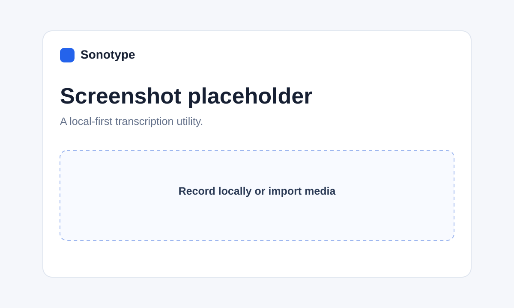

# Sonotype

> Local-first audio and video transcription, in a focused desktop workspace.



Sonotype turns recordings, media files, and permitted YouTube videos into editable transcripts without accounts, telemetry, or a cloud transcription API.

## Features

- Import common audio and video formats, including MP3, WAV, M4A, MP4, MOV, and WebM
- Record directly from your microphone
- Import audio from a YouTube URL when you own the content or have permission to download it
- CPU transcription powered by faster-whisper
- Live local progress updates and editable timestamped transcripts
- Optional anonymous speaker diarization (`Speaker 1`, `Speaker 2`, and so on)
- Copy text or export DOCX and PDF files
- Native desktop window with pywebview, plus a FastAPI development server

## How it works

Sonotype starts a local server on `127.0.0.1` and processes each file on your computer. Imported files and downloaded audio are placed in `runtime/uploads` only while a transcription job is running, then removed in a `finally` block. The application has no sign-in, analytics, telemetry, upload service, or cloud transcription API.

The first run of faster-whisper may download the selected model to your local model cache. For an air-gapped setup, stage the model cache before running Sonotype. FFmpeg should be installed locally for reliable support across the full audio/video import list.

## Download (Windows)

Grab the latest `Sonotype-Windows-x64.zip` from [Releases](../../releases), unzip, and double-click `Sonotype.exe`. No Python install required.

## Install and run (developers)

Sonotype supports Python 3.10–3.12.

```bash
git clone <your-repository-url>
cd sonotype
python3 -m venv .venv
source .venv/bin/activate        # Windows: .venv\Scripts\activate
pip install -r requirements.txt
python desktop.py
```

You can also use `./launch.sh` on macOS/Linux (make it executable with `chmod +x launch.sh`) or `launch.bat` on Windows.

For browser-based development:

```bash
uvicorn app.main:app --host 127.0.0.1 --port 8765
```

Then open <http://127.0.0.1:8765>.

Set `SONOTYPE_WHISPER_MODEL` to choose another installed faster-whisper model. The default is `base.en` and is optimized for English CPU use.

## YouTube usage

YouTube import downloads audio to the local runtime directory through `yt-dlp`, transcribes it locally, and deletes the temporary file when the job ends. Use this only for videos you own or are permitted to download, and follow YouTube’s terms and applicable law.

## Optional speaker diarization

Install the optional local dependency, then point Sonotype at a local compatible pipeline:

```bash
pip install -r requirements-diarization.txt
export SONOTYPE_DIARIZATION_MODEL=/absolute/path/to/local/pipeline
```

See [DIARIZATION.md](DIARIZATION.md) for limitations and setup notes. Diarization uses generic, anonymous labels only; it does not identify people.

## Tech stack

- FastAPI + Uvicorn
- [faster-whisper](https://github.com/SYSTRAN/faster-whisper)
- [pywebview](https://pywebview.flowrl.com/)
- [yt-dlp](https://github.com/yt-dlp/yt-dlp)
- python-docx and ReportLab

## License

MIT. See [LICENSE](LICENSE).

Built by Brandon Hatcher.
